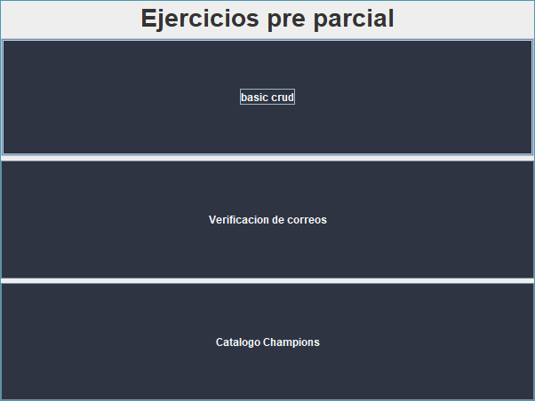
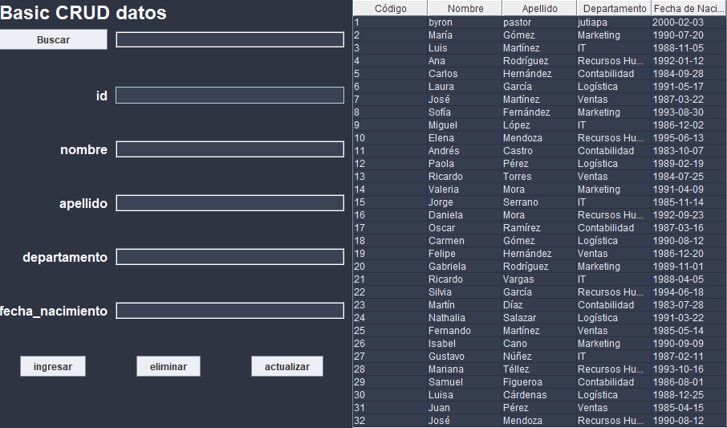
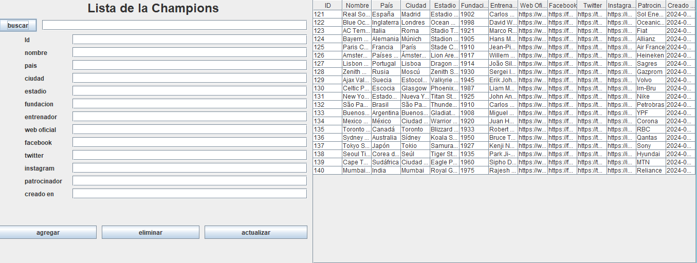
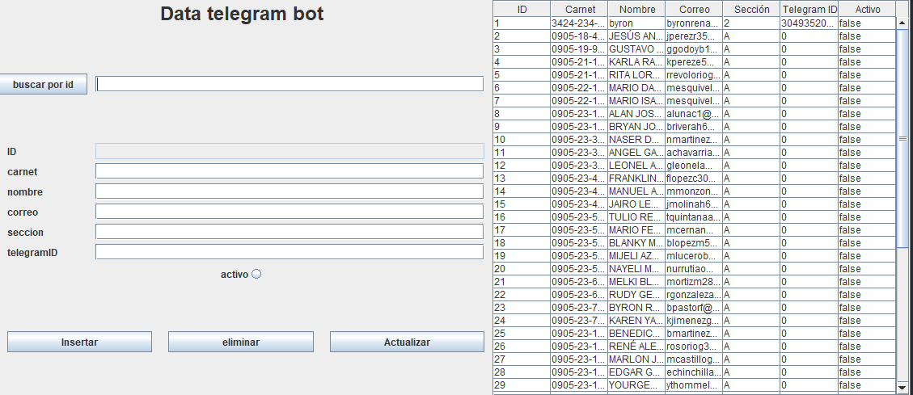

# pre-parcial

requerimientos para clonar el proyecto correctamente.

> [!NOTE]
> ejecuta esto para clonar solo el programa del preparcial.
> ```shell
> git clone -b pre-parcial https://github.com/Thebyren/tareas_java_2
>```
> [!IMPORTANT]
> ejecutar esto para replicar las tabla creadas.
> ```sql
> create database dbpreparcial;
>use dbpreparcial;
>CREATE TABLE tb_datos (
>  codigo int(11) NOT NULL AUTO_INCREMENT,
>  nombre varchar(45) DEFAULT NULL,
>  apellido varchar(45) DEFAULT NULL,
>  departamento varchar(45) DEFAULT NULL,
>  fecha_nacimiento date,
>   PRIMARY KEY (codigo)
>);
>CREATE TABLE tb_usuarios (
>  idusuario INT NOT NULL AUTO_INCREMENT,
>  carne VARCHAR(15) NULL,
>  nombre VARCHAR(70) NULL,
>  correo VARCHAR(45) NULL,
>  seccion VARCHAR(1) NULL,
>  telegramid BIGINT NULL,
>  activo VARCHAR(1) NULL,
>  PRIMARY KEY (idusuario)
>  );
>CREATE TABLE equipos_champions (
>    id_equipo INT AUTO_INCREMENT PRIMARY KEY,
>    nombre VARCHAR(100) NOT NULL,
>    pais VARCHAR(50) NOT NULL,
>    ciudad VARCHAR(50),
>    estadio VARCHAR(100),
>    fundacion YEAR,
>    entrenador VARCHAR(100),
>    web_oficial VARCHAR(200),
>    facebook VARCHAR(200),
>    twitter VARCHAR(200),
>    instagram VARCHAR(200),
>    patrocinador_principal VARCHAR(100),
>    creado_en TIMESTAMP DEFAULT CURRENT_TIMESTAMP
> );
> ```

>[!NOTE]
> para replicar los datos exactos usados aqui ejecute las consultas dadas en [example.sql](./example.sql)

### GUI principal



---

### GUI de basicCrud (los usuarios genericos)

---
### GUI de ListChampions (las de la champions)

---
### GUI de verifyMails (usuarios de telebot)

---